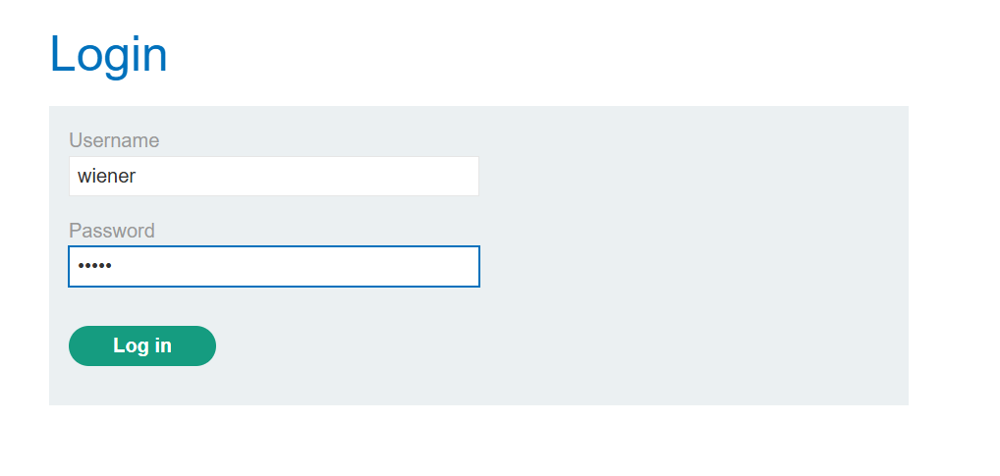
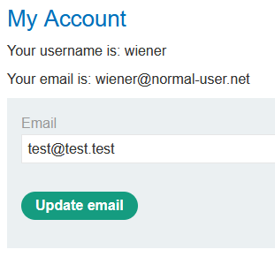
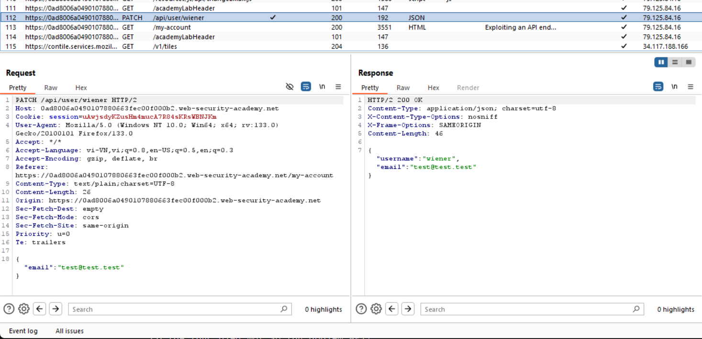
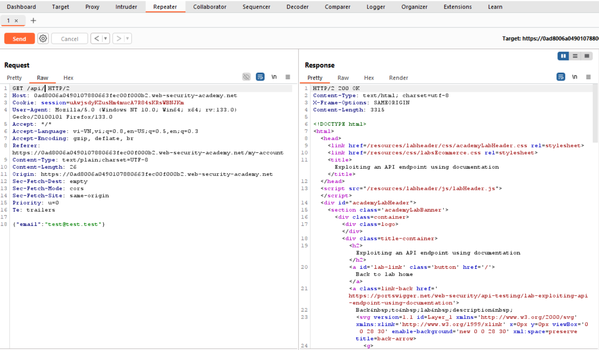
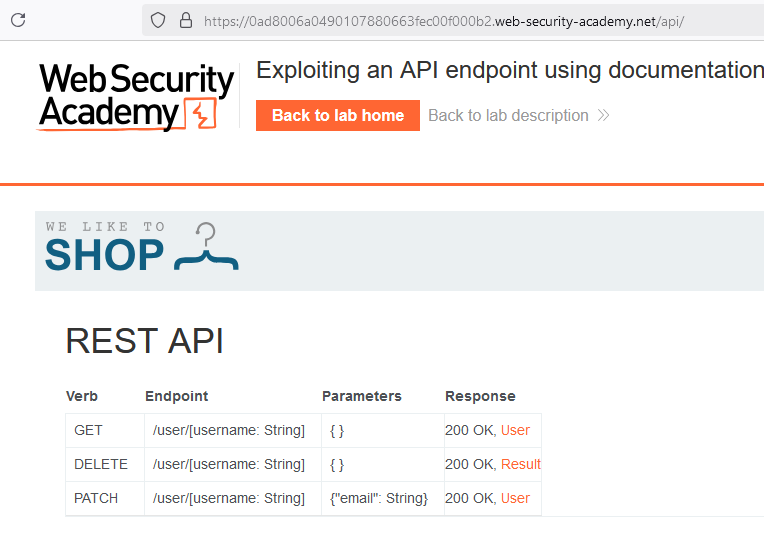
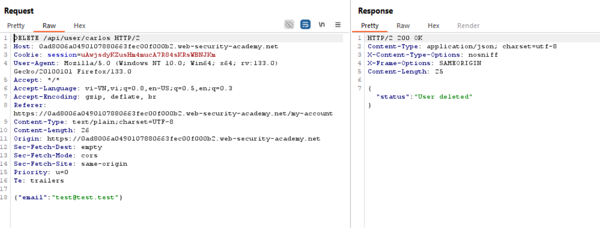
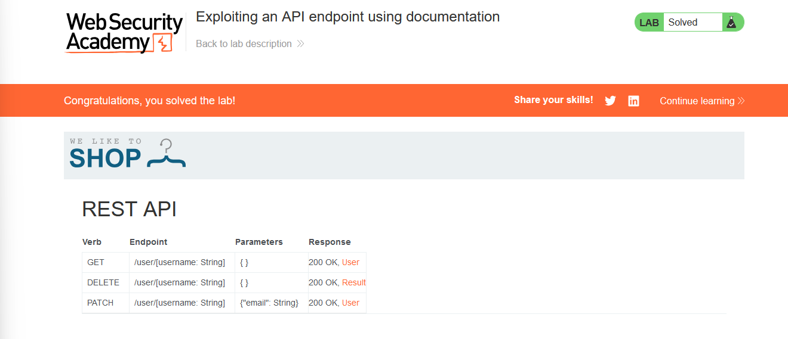

# 🔍 Mastering API Testing: Exploiting an API Endpoint

Welcome to this detailed write-up on solving the **"Exploiting an API endpoint using documentation"** lab from PortSwigger Academy. This guide will walk you through the steps to analyze and exploit API endpoints using publicly available documentation. Let’s jump right in!

---

## 📚 Table of Contents

- [Introduction](#introduction)
- [Lab Objectives](#lab-objectives)
- [Step 1: Understanding the Scenario](#step-1-understanding-the-scenario)
- [Step 2: Exploring the API](#step-2-exploring-the-api)
- [Step 3: Exploitation in Action](#step-3-exploitation-in-action)
- [Conclusion & Learnings](#conclusion--learnings)

---

## 📝 Introduction

In this lab, you will learn how to exploit API endpoints by leveraging exposed documentation. By following this guide, you’ll gain a deeper understanding of API testing and how to identify security flaws.

**Difficulty Level:** ★☆☆☆☆☆☆☆☆☆

Let’s get started!

---

## 🎯 Lab Objectives

Your mission is to:

1. Identify the API documentation.
2. Analyze available endpoints and methods.
3. Exploit the API to delete the `carlos` user account.

**Credentials for the lab:**

- **Username:** `wiener`
- **Password:** `peter`

---

## 1️⃣ Step 1: Understanding the Scenario

### 🌐 Logging into the Application

1. Go to the homepage and log in with the credentials provided:

   ```plaintext
   Username: wiener
   Password: peter
   ```


2. Once logged in, click on **My Account** to explore user functionalities.

### 🛠 Intercepting HTTP Traffic

Use **Burp Suite** to capture requests. For example, when updating your email address, observe the following HTTP request:

```http
PATCH /api/user/wiener HTTP/2
Host: your-lab-url
Content-Type: application/json

{
  "email": "newemail@example.com"
}
```


From this, we identify the endpoint `/api/user/<username>` used for interacting with user data.

---


## 2️⃣ Step 2: Exploring the API

### Identifying Documentation

To discover more about the API, send a `GET` request to `/api`:

```http
GET /api HTTP/2
Host: your-lab-url
```

#### API Endpoints

The response reveals the following endpoints and methods:

| Method | Endpoint              | Parameters        | Response            |
|--------|-----------------------|-------------------|---------------------|
| GET    | /user/[username]      | None              | 200 OK, User info   |
| PATCH  | /user/[username]      | {"email": String} | 200 OK, Updated info|
| DELETE | /user/[username]      | None              | 200 OK, User deleted|

The `DELETE` method stands out as it might allow deleting user accounts.

### Investigating the API Base Path

Further exploration involves examining potential documentation paths:

- `/api`
- `/swagger/index.html`
- `/openapi.json`
  


These can reveal additional details about the API’s functionality. In our case, the base path `/api/user/<username>` allows interaction with user accounts.

---

## 3️⃣ Step 3: Exploitation in Action

### 🔥 Sending the DELETE Request

Our target is to delete the `carlos` account. Craft the following request:

```http
DELETE /api/user/carlos HTTP/2
Host: your-lab-url
```

### ✅ Verifying Success

If the server responds with `200 OK`, the `carlos` account has been successfully deleted.

---

## 📌 Conclusion & Learnings

In this lab, we achieved the following:

1. Discovered API documentation and endpoints.
2. Analyzed and tested HTTP methods (GET, PATCH, DELETE).
3. Exploited an unprotected DELETE endpoint to remove a user account.

### 💡 Key Takeaways

- Always investigate exposed documentation for APIs.
- Test endpoints thoroughly to understand their functionality.
- Check for missing access controls, especially for sensitive operations like DELETE.

Thank you for following along! Feel free to share feedback or questions. Happy hacking! 🎉

