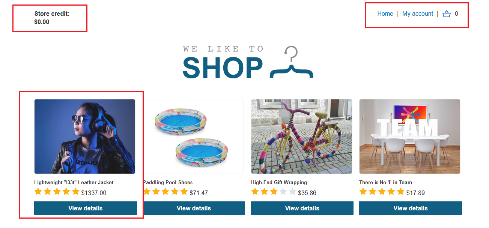
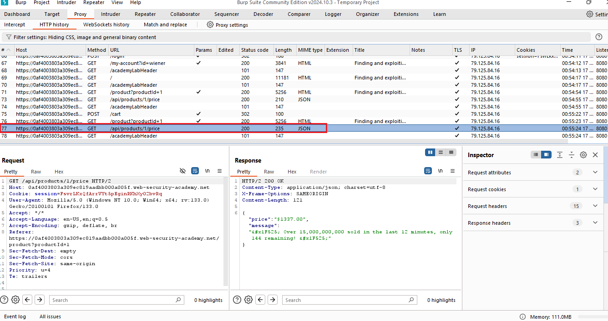
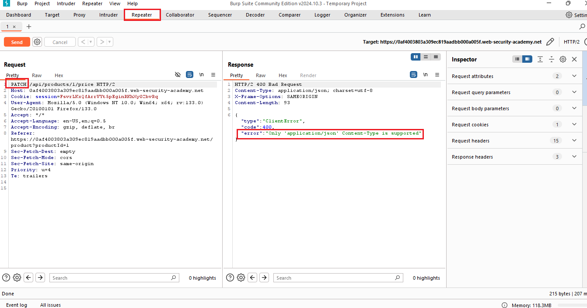
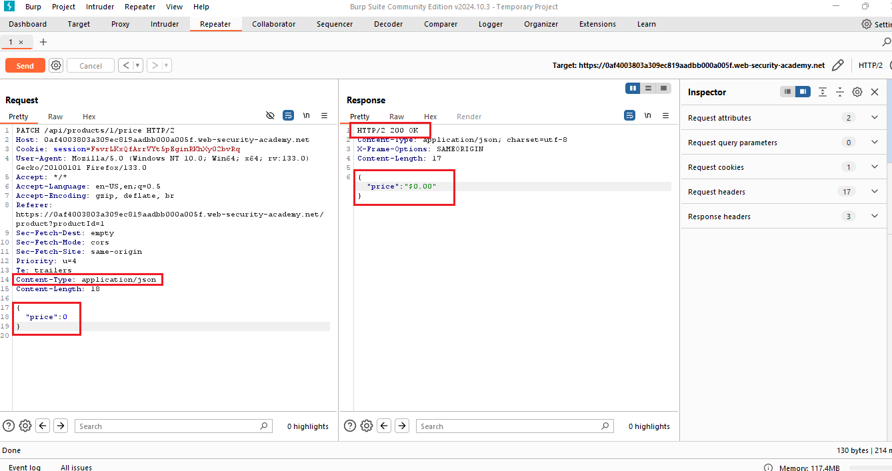
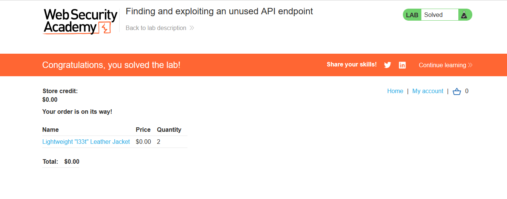

**Version**: 1.0  
**Author**: [Trung Huynh](https://www.linkedin.com/in/trung-huynh-chi-pc01/)  

  
  
  
  
  

---
# 🧪 Finding and Exploiting an Unused API Endpoint

Welcome to this hands-on lab tutorial: **Finding and Exploiting an Unused API Endpoint** from PortSwigger. This guide will teach you how to uncover hidden API functionality and exploit it to achieve your goal. Let’s dive into the world of API pentesting!

---

## 📖 Table of Contents

- [🔍 Lab Description](#lab-description)
- [🔧 Required Knowledge](#required-knowledge)
- [🔗 Accessing the Lab](#accessing-the-lab)
- [💡 Solution Walkthrough](#solution-walkthrough)
  - [Step 1: Explore the API Endpoint](#step-1-explore-the-api-endpoint)
  - [Step 2: Discover Hidden Functionality](#step-2-discover-hidden-functionality)
  - [Step 3: Authenticate and Modify the Request](#step-3-authenticate-and-modify-the-request)
  - [Step 4: Verify and Purchase](#step-4-verify-and-purchase)
- [📋 Tips and Notes](#tips-and-notes)
- [📚 License](#license)

---

## 🔍 Lab Description

In this lab, your goal is to exploit a hidden API endpoint to buy a **Lightweight l33t Leather Jacket** for free. You can log in to your own account using the following credentials:

```
wiener:peter
```



---

## 🔧 Required Knowledge

To successfully solve this lab, you’ll need to know:

1. 🔹 How to use error messages to construct a valid request.
2. 🔹 How HTTP methods are used by RESTful APIs.
3. 🔹 How changing the HTTP method can reveal additional functionality.

These concepts are covered in the [API Testing Academy](https://portswigger.net/web-security/api) topic by PortSwigger.

---

## 🔗 Accessing the Lab

1. Open **Burp Suite** and access the lab in Burp's browser.
2. Log in using the credentials provided: `wiener:peter`.

---

## 💡 Solution Walkthrough

### Step 1: Explore the API Endpoint

- Navigate to a product in the lab's web application.
- In **Proxy > HTTP history**, locate the API request for the product (e.g., `/api/products/3/price`).
- Right-click the request and select **Send to Repeater**.



### Step 2: Discover Hidden Functionality

- In **Repeater**, change the HTTP method from `GET` to `OPTIONS` and send the request.
- Note the response specifying the allowed methods: `GET` and `PATCH`.



### Step 3: Authenticate and Modify the Request

- Log in using the credentials `wiener:peter`.
- Click on the Lightweight "l33t" Leather Jacket product.
- Locate the API request for the jacket (e.g., `/api/products/1/price`) and send it to Repeater.
- Change the HTTP method to `PATCH` and set the `Content-Type` header to `application/json`.
- Add an empty JSON object `{}` as the request body and send the request. Notice the error indicating the need for a `price` parameter.
- Update the request body with `{"price":0}` and resend it.



### Step 4: Verify and Purchase

- Refresh the product page in Burp's browser. The jacket price should now display as `$0.00`.
- Add the jacket to your basket and place the order to solve the lab.



---

## 📋 Tips and Notes

- 🔑 Always examine error messages carefully; they often provide hints about required parameters or valid request formats.
- 🔄 Use different HTTP methods (e.g., `GET`, `POST`, `PATCH`) to discover undocumented API features.
- 🛠️ Utilize tools like Burp Suite Repeater to manipulate and analyze requests efficiently.

---

## 📚 License

This project is licensed under the [MIT License](LICENSE).


---

Feel free to contribute or raise issues if you have ideas to improve this guide!
