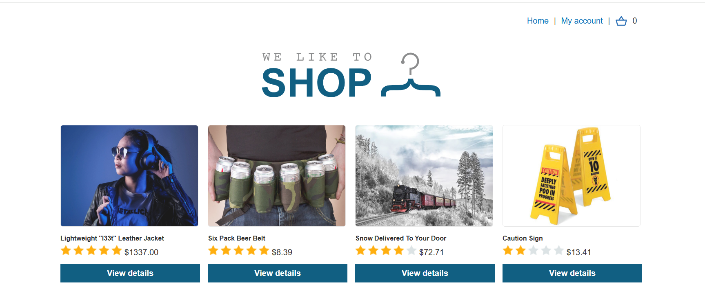
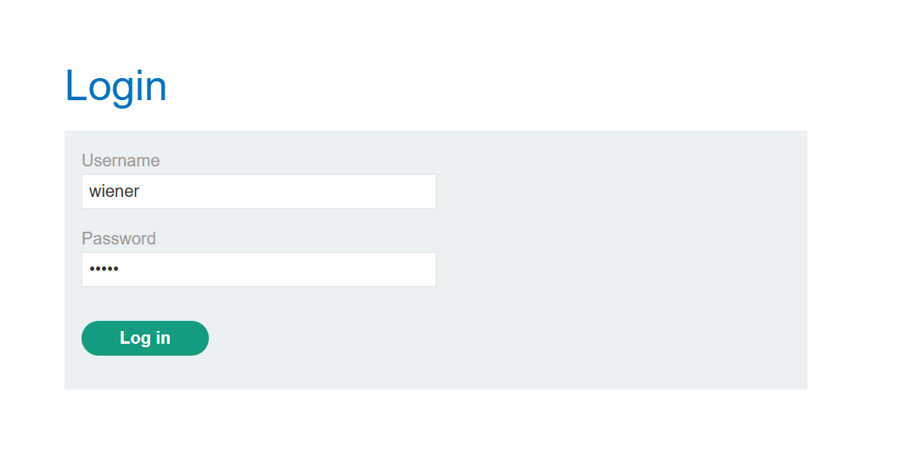
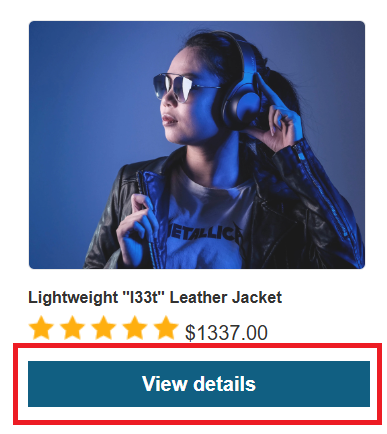
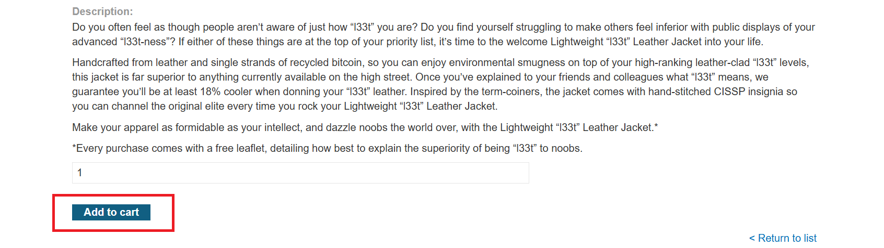
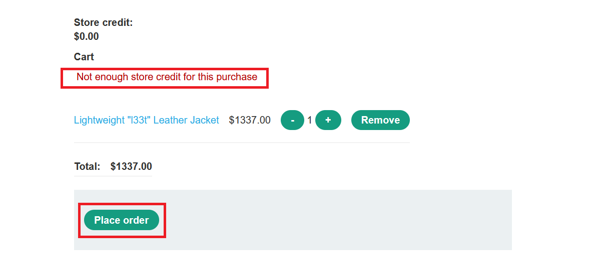
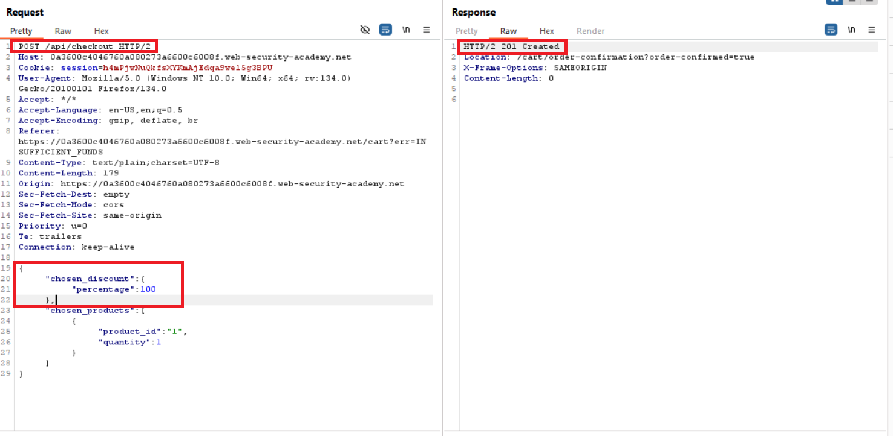
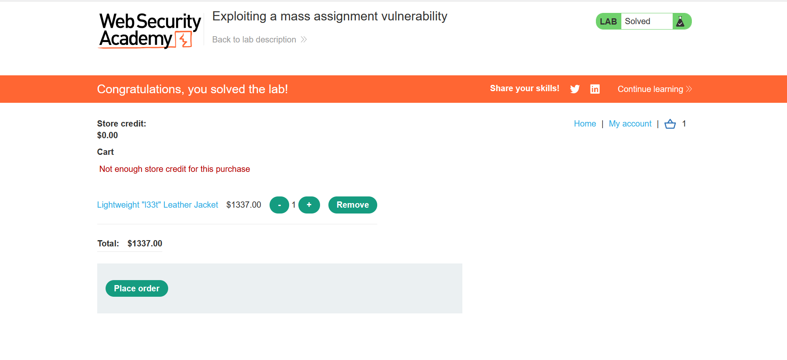

**Version**: 1.0  
**Author**: [Trung Huynh](https://www.linkedin.com/in/trung-huynh-chi-pc01/)

  
  


# **Exploiting a Mass Assignment Vulnerability** 🛡️

---

## **📜 Table of Contents**
1. [Overview](#overview)
2. [Background](#background)
3. [Enumeration](#enumeration)
4. [Exploitation](#exploitation)
5. [Conclusion](#conclusion)

---

## **✨ Overview**  
🎉 **Welcome to another exciting write-up!**  
In this PortSwigger Labs lab, we'll explore how to exploit a **Mass Assignment Vulnerability** to gain unauthorized benefits. Buckle up as we dive into the step-by-step process!  

**Difficulty Level:** ★☆☆☆☆☆☆☆☆☆  

---

## **🛠️ Background**  
In this lab, you'll exploit a **mass assignment vulnerability** to buy a **Lightweight l33t Leather Jacket** for free. Log in using the following credentials:  
- **Username:** `wiener`  
- **Password:** `peter`  

Your mission: Identify and exploit the vulnerability to complete the lab.  

---

## **🔍 Enumeration**  
### **Step 1: Exploring the Home Page**  
Upon accessing the home page, you can browse and purchase products:  



### **Step 2: Logging In**  
Log in with the provided credentials:  



### **Step 3: Discovering the API**  
Navigate to a product’s detail page by clicking **"View Details"**:  



Add the product to your cart:  




Open your cart and inspect the page source (**Ctrl + U**):  

```html
<script type='text/javascript'>
    const getApiEndpoint = () => '/api/checkout';
</script>
```


This reveals an API endpoint: `/api/checkout`. Further investigation in `/resources/js/api/checkout.js` shows two available methods, **GET** and **POST**, allowing interaction with the cart details and checkout process.

---

## **💥 Exploitation**  
### **Step 4: Understanding the Vulnerability**  
Mass Assignment allows binding unintended parameters to internal objects. By leveraging this, you can apply a **non-existent discount**.

Here's the crafted JSON payload for the **POST** request:  
```json
{
    "chosen_discount": {
        "percentage": 100
    },
    "chosen_products": [
        {
            "product_id": "1",
            "quantity": 1
        }
    ]
}
```

Send this payload to `/api/checkout` using the **POST** method:  




🎉 **Result:** You successfully purchased the product for free!

---

## **🏁 Conclusion**  
### **Key Takeaways:**  
1. **Mass Assignment Vulnerability:**  
   - Auto-binding can expose unintended parameters.  
2. **APIs and Hidden Parameters:**  
   - Always inspect API endpoints and their methods.  
3. **Critical Thinking:**  
   - Exploiting small hints like JavaScript variables can lead to significant vulnerabilities.

🎯 **Goal Achieved:** We successfully exploited the vulnerability and gained the desired item without any cost!  

---

### **💡 Stay curious, keep exploring, and happy hacking!** 💻✨


